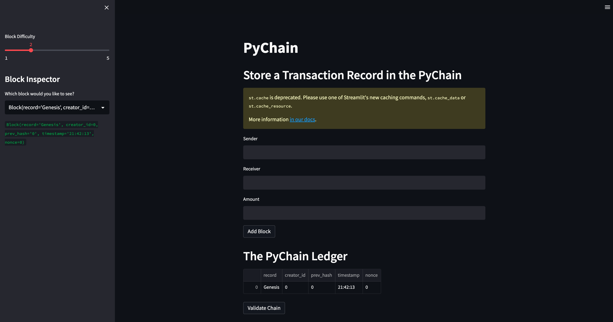
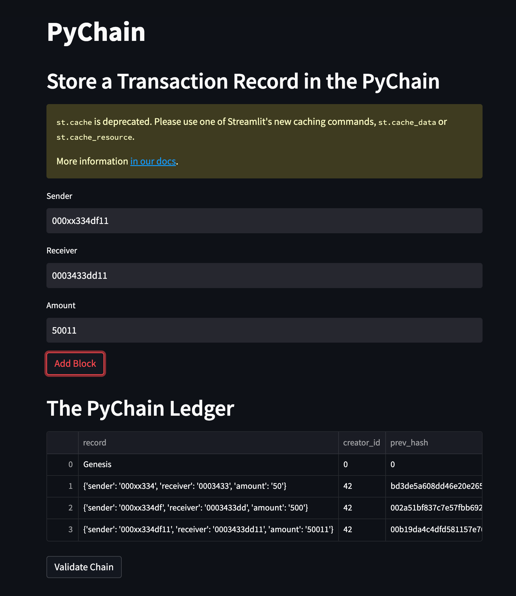
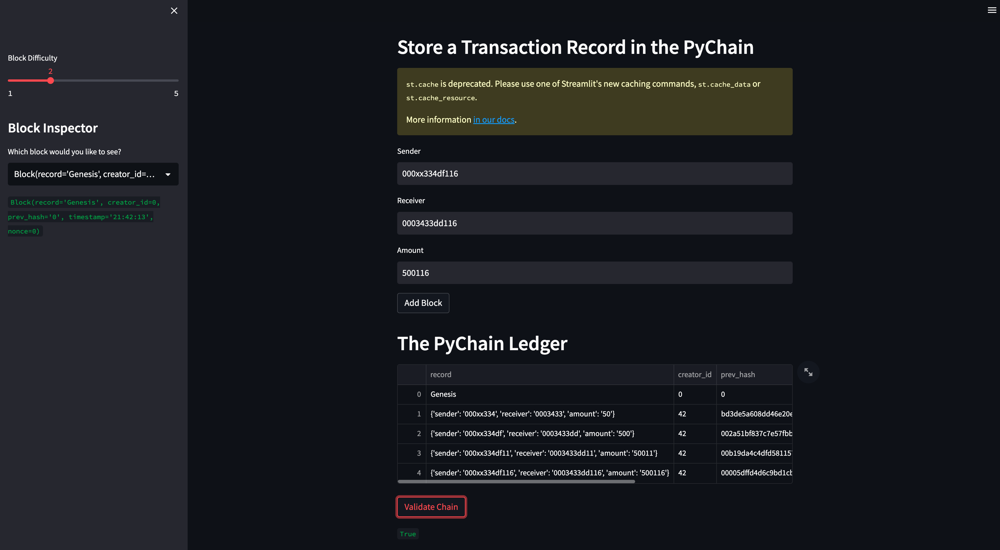

# Blockchain Ledger


---

## Description
This project builds a simple blockchain. It uses streamlit to be able to have user interaction. When you first open the application it looks like this:


Users are able to then input into the "Sender", "Receiver" and "Amount" fields. After all fields have values, a user clicks "Add Block". You will see the information show up on "The PyChain Ledger", which can be seen below:


After blocks have been added, we want to ensure that the blockchain that we have created is indeed valid. To do this, the user will click "Validate Chain". If the information is entered correctly, the result should say "true". At the bottom of the image, we can see that our blockchain has been validated.


At this time, that is the full scope of the application. Below is a GIF of the whole application process and current capabilities.


---

## Table of Contents
- [Blockchain Ledger](#blockchain-ledger)
  - [Description](#description)
  - [Table of Contents](#table-of-contents)
  - [1. Installation](#1-installation)
  - [2. Usage](#2-usage)
  - [3. License](#3-license)
  - [4. Contributing](#4-contributing)
  - [5. Tests](#5-tests)
  - [6. Deployment](#6-deployment)
  - [7. Contact](#7-contact)

---

## 1. Installation

  If you would like to clone the repository, type "git clone https://github.com/kheller18/blockchain-ledger.git". In the terminal, with the Anaconda dev environment activated, install the following packages and dependencies before running the application. To understand how to install these, refer to the [Usage](#2-usage)

  * [Pandas](https://pandas.pydata.org/docs/) (1.3.5) - Data analysis

  * [Streamlit](https://streamlit.io/) (1.18.1) - Web interface

---

## 2. Usage

  After cloning the repository locally, you'll need to have the packages listed in [Installation](#1-installation) installed on your machine. To do so, you'll need to activate your conda dev environment and running the following commands:

      ```
      pip install pandas
      pip install streamlit

      ```

  After all of these are installed, please refer to the [Deployment](#6-deployment) section for instructions on how to view or edit the notebook.

---

## 3. License
  ```
  MIT License

  Copyright (c) 2023 Keenan Heller

  Permission is hereby granted, free of charge, to any person obtaining a copy
  of this software and associated documentation files (the "Software"), to deal
  in the Software without restriction, including without limitation the rights
  to use, copy, modify, merge, publish, distribute, sublicense, and/or sell
  copies of the Software, and to permit persons to whom the Software is
  furnished to do so, subject to the following conditions:

  The above copyright notice and this permission notice shall be included in all
  copies or substantial portions of the Software.

  THE SOFTWARE IS PROVIDED "AS IS", WITHOUT WARRANTY OF ANY KIND, EXPRESS OR
  IMPLIED, INCLUDING BUT NOT LIMITED TO THE WARRANTIES OF MERCHANTABILITY,
  FITNESS FOR A PARTICULAR PURPOSE AND NONINFRINGEMENT. IN NO EVENT SHALL THE
  AUTHORS OR COPYRIGHT HOLDERS BE LIABLE FOR ANY CLAIM, DAMAGES OR OTHER
  LIABILITY, WHETHER IN AN ACTION OF CONTRACT, TORT OR OTHERWISE, ARISING FROM,
  OUT OF OR IN CONNECTION WITH THE SOFTWARE OR THE USE OR OTHER DEALINGS IN THE
  SOFTWARE.
  ```
---

## 4. Contributing

  + [Keenan Heller](https://github.com/kheller18)

---

## 5. Tests

  + There are currently no tests associated with this project.

---

## 6. Deployment
  + There is currently no live deployment of this app on a common server. To be able to run this app locally, navigate to the root directory and type "streamlit run pychain.py". This should open the app automatically, but if it doesn't, go to [localhost 8501](http://localhost:8501/) in your browser.

---

## 7. Contact

  + [Keenan's LinkedIn](https://www.linkedin.com/in/keenanheller/)

---